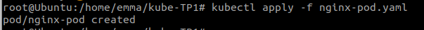
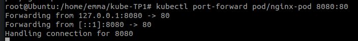
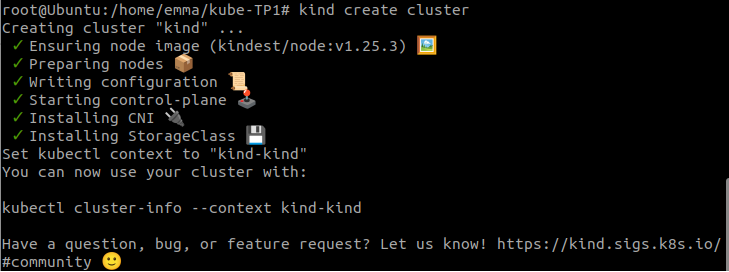
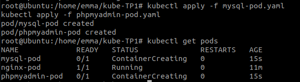
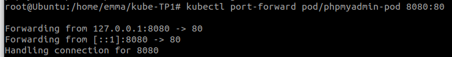
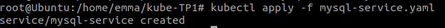
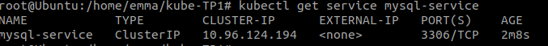
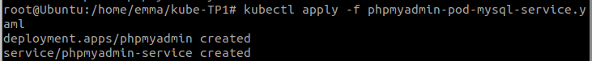
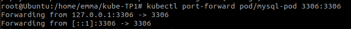
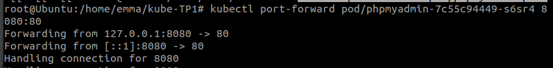

# kube-tp1
## Installer Kind et Kubect
```
curl -Lo ./kind https://kind.sigs.k8s.io/dl/v0.17.0/kind-linux-amd64
curl -LO "https://dl.k8s.io/release/$(curl -L -s https://dl.k8s.io/release/stable.txt)/bin/linux/amd64/kubectl"
```
## Pod Nginx

### Héberger un premier Pod Nginx

Créer un fichier nginx-pod.yaml
Appliquer les config du fichier :
```
kubectl apply -f nginx-pod.yaml
```


Vérifier que le pod a été créer :
```
kubectl get pods
```


### A l’aide de la commande kubectl port-forward et d’un navigateur accéder à la page par défaut de votre pod Nginx



##  Connexion entre plusieurs Pods

### A l’image du TP 1 sur Docker (question 7 et 8), héberger un Pod phpmyadmin et mysql, cette fois-ci en utilisant kind
Créer un cluster Kubernetes local :
```
kind create cluster
```

On créer un fichier pour mysql et pour phpmyadmin :

```
touch mysql-pod.yaml
touch phpmyadmin-pod.yaml

```
On déploie les pods :
```
kubectl apply -f mysql-pod.yaml
kubectl apply -f phpmyadmin-pod.yaml
```
Résultat :


On redirige le trafic vers le port de phpmyadmin:
```
kubectl port-forward pod/phpmyadmin-pod 8080:80
```


### Créer un service associé au Pod mysql

On créer un fichier :
```
mysql-service.yaml
```
On créer le service :
```
kubectl apply -f mysql-service.yaml
```


```
kubectl get service mysql-service
```

### Connecter phpmyadmin avec le Service mysql et vérifier que vous pouvez administrer cette base de données
On récupère l’ip du service  mysql pour modifier la confid du service phpmyadmind:
```
kubectl port-forward pod/phpmyadmin-pod 8080:80
```

```
kubectl apply -f phpmyadmin-pod-mysql-service.yaml
```

```
kubectl port-forward pod/mysql-pod 3306:3306
```


### Avec la commande kubectl-port forward, vérifier que phpmyadmin arrive à contacter et administrer votre base de données mysql
```
kubectl port-forward pod/phpmyadmin-7c55c94449-s6sr4 8080:80
```


### Ajouter un Ingress pour accéder à phpmyadmin sans utiliser la commande kubectl port-forward
```
touch ingress.yaml
kubectl apply -f ingress.yaml
```
